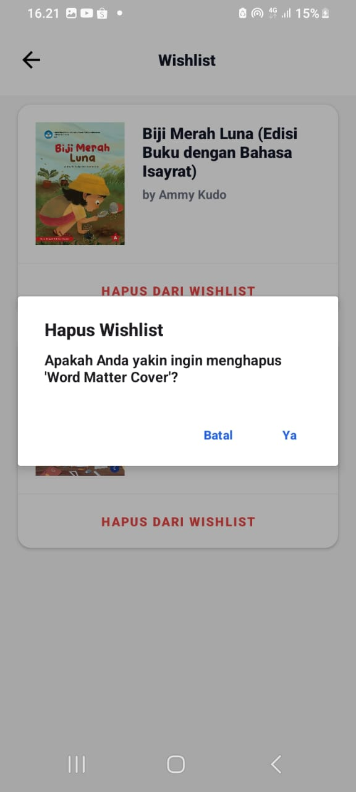

# NusantaraPustaka

**Nama**  : Keke Indah Parawansyah  
**NIM**   : 2304411464  
**Kelas** : 5I RPL GAB 1  

---

### Deskripsi Aplikasi

Aplikasi **Nusantara Pustaka** merupakan aplikasi Android bertema *light* yang terinspirasi dari **Gramedia Digital**. Aplikasi ini dikembangkan menggunakan **bahasa pemrograman Kotlin** dan **Firebase** sebagai database, serta dibuat untuk memenuhi **tugas Ujian Akhir Semester** mata kuliah **Aplikasi Mobile 2**.

---

### Fitur yang Tersedia

1. **Login dan Pendaftaran Akun**
2. **Pencarian Buku**
3. **Preview Buku**
4. **Pembelian Buku** (masih dalam tahap uji coba)
5. **Membaca Buku Digital**
6. **Menambahkan Buku ke Wishlist**
7. **Manajemen Profil**
   - Mengubah nama pengguna
   - Mengubah kata sandi
   - Menghapus akun
8. **Logout**
---

### Cara Menggunakan Aplikasi Nusantara Pustaka

#### 1. Login atau Daftar Akun
1. Buka aplikasi **Nusantara Pustaka**.
2. Pilih menu **Daftar** jika belum memiliki akun.
   - Isi data seperti **Nama**, **Email**, dan **Password** pada kolom yang tersedia.
3. Jika sudah memiliki akun, pilih menu **Login**, lalu masukkan **Email** dan **Kata Sandi**.

#### 2. Masuk ke Halaman Beranda
Setelah proses login berhasil, pengguna akan diarahkan ke **halaman Beranda**.  
Pada halaman ini, pengguna dapat:
- Melihat **katalog buku** yang tersedia.
- Menggunakan **fitur pencarian** untuk mencari buku berdasarkan judul atau kategori.

#### 3. Memilih dan Membaca Buku
1. Klik **judul buku** untuk melihat detail buku.
2. Gunakan tombol **Preview** untuk melihat contoh isi buku.
3. Klik tombol **Beli** (fitur masih dalam tahap uji coba).
4. Setelah buku dibeli, buku akan otomatis masuk ke **Koleksi Saya**.
5. Klik ikon baca buku yang ada di koleksi untuk mulai **membaca buku secara penuh**.

## Tampilan Aplikasi

### Login & Registrasi

  
  

### Beranda

  

### Detail Buku

  

### Pembayaran

  

### Koleksi

  
  

### Membaca Buku

  

### Profil & Pengaturan

  
  
  

